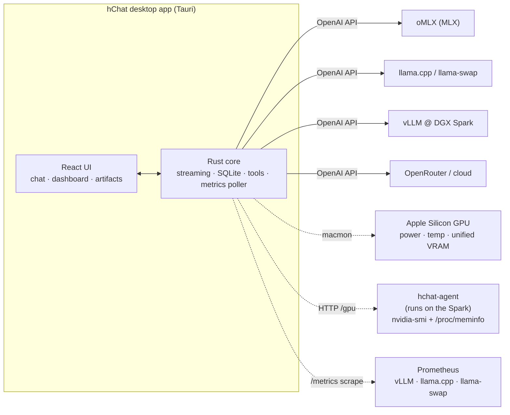

# hChat

A local-LLM **workstation** for your desktop: a fast chat client, a live
inference-metrics dashboard, and an artifact-rendering panel — over any
OpenAI-compatible endpoint.

Point it at a remote **DGX Spark** running vLLM, your MacBook running **oMLX**
(MLX) and **llama.cpp** (GGUF), **OpenRouter**, **LM Studio**, **Ollama**, or
anything else that speaks the OpenAI API — chat with your models and watch decode
tok/s, TTFT, prefill, requests, VRAM, power, and per-GPU stats for each backend.

Built with [Tauri](https://tauri.app): a Rust core (streaming, SQLite history,
tools, metrics) behind a React/TypeScript UI — a small native binary, not an
Electron app.

## Features

- **Streaming chat** against any OpenAI-compatible endpoint, with per-conversation
  model, system prompt, and sampling settings
- **Multiple backends** at once — switch from the top bar; each conversation
  remembers its own. Arbitrary URLs/ports, per-endpoint API keys
- **Live metrics dashboard** — decode/TTFT/prefill, requests, VRAM, power, temp,
  KV-cache, and per-GPU rows, with throughput, TTFT, and GPU util/power charts.
  Apple-Silicon GPU
  stats via [macmon](https://github.com/vladkens/macmon) (no sudo); remote NVIDIA
  boxes via the bundled **`hchat-agent`**; vLLM / llama.cpp / llama-swap via
  Prometheus
- **Native tool calling** — the model can read files, search code, run shell
  commands, and write into a working directory. Five tools ship pre-configured;
  destructive ones prompt for approval (with "approve all in this conversation").
  Define your own as TOML in `~/.config/hchat/tools/`
- **MCP** — connect to [Model Context Protocol](https://modelcontextprotocol.io)
  servers (stdio or streamable HTTP); their tools join the model's tool set
  automatically. Manage in Settings → MCP or `config.toml`
- **Skills & commands** — drop-in [`~/.agents`](https://www.dot-agents.com/)
  resources: `commands/` become slash commands, `skills/` are model- or
  manually-invoked, shared with your other agents (user- and project-level)
- **Artifacts panel** — renders the HTML (live, sandboxed iframe), SVG, Markdown,
  Mermaid diagrams, and code your models produce, with a preview/source toggle
- **Branching** — regenerate or edit any message to fork a sibling; navigate
  with `◀ N/M ▶`
- **Attachments** — drag-drop / paste images for vision models; drop text files to
  inline them as fenced code
- **Presets** — save a model + endpoint + sampling bundle and apply it elsewhere
- **Reasoning models** — `<think>` blocks and provider `reasoning` deltas render
  as collapsible sections
- **Markdown** rendering with syntax highlighting (shiki) and per-code-block copy
- **Keyboard-first** — slash commands, find-in-conversation, drafts, a live token
  counter, and fully **rebindable shortcuts**
- **SQLite history** with auto-titles, search, pin, rename, and markdown export;
  group chats into **projects** (drag a chat onto a project; pin projects + chats
  to the top)
- Light/dark themes, configurable fonts and UI scale; `config.toml` stays the
  hand-editable source of truth
- Cross-platform (macOS, Linux)

## How it works

hChat is a thin, fast client. The Rust core makes OpenAI-compatible requests to
whatever servers you point it at, measures each request as it streams, and polls
each backend's metrics sources to populate the dashboard. Nothing leaves your
machines unless you configure a cloud endpoint.



Solid arrows are chat traffic; dotted arrows are metrics. Per-request
decode/TTFT/prefill is always measured client-side; the dotted sources add
server-wide throughput and GPU stats.

## Requirements

- **[Rust toolchain](https://rustup.rs)** (stable) — `rustc` 1.85+
- **[Node.js](https://nodejs.org) 20+** and npm
- **Tauri system dependencies** for your platform (the native webview + build
  tools):
  - **macOS** — Xcode Command Line Tools: `xcode-select --install`
  - **Debian/Ubuntu** —
    ```bash
    sudo apt install libwebkit2gtk-4.1-dev build-essential curl wget file \
      libxdo-dev libssl-dev libayatana-appindicator3-dev librsvg2-dev
    ```
  - **Arch** —
    ```bash
    sudo pacman -S --needed webkit2gtk-4.1 base-devel curl wget file openssl \
      appmenu-gtk-module libappindicator-gtk3 librsvg
    ```
  - Other distros / full details: [Tauri prerequisites](https://tauri.app/start/prerequisites/)

## Build & run

```bash
git clone https://github.com/heath0xFF/hChat
cd hChat

npm install          # frontend deps + Tauri CLI
npm run tauri dev    # run the app (hot reload)

npm run tauri build  # produce a release bundle (.app / .dmg / .deb)
```

There are no prebuilt binaries yet — build from source with the steps above.
`npm run tauri dev` runs the app in development with hot reload — use this day to
day. `npm run tauri build` compiles an optimized frontend (`vite build`) and a
release Rust binary, then packages a **native installer for your platform** — a
`.app` + `.dmg` on macOS, a `.deb` / `.AppImage` / `.rpm` on Linux — under
`src-tauri/target/release/bundle/`. The standalone binary is at
`src-tauri/target/release/hchat` if you just want to copy that somewhere on your
`PATH`.

## Migrating from a previous (Homebrew) install

hChat reads and writes the same files as the older version, so your
conversations, settings, and custom tools carry over **automatically** — nothing
to export or import:

- **Conversations** (SQLite): `~/Library/Application Support/hchat/hchat.db`
  (macOS) · `~/.local/share/hchat/hchat.db` (Linux)
- **Config**: `~/.config/hchat/config.toml`
- **Custom tools**: the hChat config dir — `~/Library/Application Support/hchat/tools/`
  (macOS) · `~/.config/hchat/tools/` (Linux)

To switch over:

```bash
# 1. (optional) back up your database
cp ~/Library/Application\ Support/hchat/hchat.db ~/hchat-backup.db

# 2. remove the old Homebrew install
brew uninstall --cask hchat   # if you installed the .app cask
brew uninstall hchat          # if you installed the CLI binary

# 3. build and run the new version (see "Build & run" above)
```

On first launch hChat reads your existing `config.toml` — new fields (hotkeys,
per-endpoint metrics) just take their defaults — and runs SQLite schema
migrations in place, so older history upgrades without data loss. A corrupt
config is backed up rather than overwritten.

## Backends

hChat is a client — point it at a running OpenAI-compatible server. Add endpoints
in **Settings → Endpoints** (or in `config.toml`); switch from the top-bar
dropdown.

| Backend | Typical endpoint | Notes |
|---|---|---|
| **oMLX** (MLX, macOS) | `http://localhost:8000/v1` | `omlx serve` from [omlx.ai](https://omlx.ai); port is configurable |
| **llama.cpp** (GGUF) | `http://localhost:8080/v1` | run `llama-server --metrics` for dashboard scraping |
| **llama-swap** | `http://host:8080/v1` | model-swapping proxy; exposes its own `/metrics` |
| **vLLM** (e.g. DGX Spark) | `http://host:8000/v1` | exposes Prometheus `/metrics` |
| **OpenRouter** (cloud) | `https://openrouter.ai/api/v1` | needs an API key |
| **LM Studio** | `http://localhost:1234/v1` | load a model + start the server |
| **Ollama** | `http://localhost:11434/v1` | `ollama pull <model>` first |

If hChat reaches an endpoint but reports "No models available", the server is up
but no model is loaded/pulled.

## Metrics dashboard

The **Status** view shows live metrics for a backend you pick from its own
endpoint dropdown (independent of the active chat). Per-request decode/TTFT/
prefill is measured client-side; richer stats are opt-in per endpoint (set them
in **Settings → Endpoints** or `config.toml`):

```toml
# llama.cpp on this Mac (start it with `llama-server --metrics`)
[[saved_endpoints]]
url = "http://localhost:8080/v1"
runtime = "llamacpp"
prometheus_url = "http://localhost:8080/metrics"   # decode/prefill/requests/KV

# Remote DGX Spark running vLLM, GPU stats via the agent (below)
[[saved_endpoints]]
url = "http://spark:8000/v1"
runtime = "vllm"
prometheus_url = "http://spark:8000/metrics"
gpu = "agent"
agent_url = "http://spark:9099"
```

- **`runtime`** — `vllm` | `omlx` | `llamacpp` | `llamaswap` | `openai`
- **`prometheus_url`** — scraped for decode/prefill tok/s, TTFT, requests, KV cache
- **`gpu`** — `macmon` (Apple Silicon, no sudo) | `agent` (remote NVIDIA) | `none`.
  Local endpoints on macOS default to `macmon` automatically, so VRAM/power/temp
  show up with no config

### The metrics agent (`hchat-agent`)

`nvidia-smi` can't report VRAM on a GB10 / DGX Spark — CPU and GPU share unified
LPDDR5X, so memory shows as `[Not Supported]`. The bundled **`hchat-agent`** reads
`nvidia-smi` (power/temp/util) *and* `/proc/meminfo` (unified VRAM) and serves them
as JSON. It's a single zero-dependency Rust binary (~450 KB) and is independent of
your inference server — it works the same whether the box runs vLLM, llama.cpp, or
llama-swap.

**1. (Optional) Confirm your server's metrics.**
- **vLLM** serves Prometheus at `/metrics` by default (`http://host:8000/metrics`).
- **llama-swap** has its own `/metrics` (`http://host:8080/metrics`).
- **plain llama.cpp** needs `llama-server --metrics`.

```bash
curl -s http://localhost:8000/metrics | head    # on the box
```

**2. Build the agent on the box** (needs the Rust toolchain and `nvidia-smi`):

```bash
git clone https://github.com/heath0xFF/hChat && cd hChat/agent
cargo build --release
sudo install -m755 target/release/hchat-agent /usr/local/bin/hchat-agent
```

> Prefer not to install Rust on the box? Cross-compile from another Linux machine
> with `rustup target add aarch64-unknown-linux-gnu` (or `…-musl` for a fully
> static binary) and `scp` the result over.

**3. Run it** — foreground to test, or as a service to persist:

```bash
hchat-agent --port 9099            # serves GET /gpu (binds 0.0.0.0 by default)
curl -s http://localhost:9099/gpu  # sanity check — JSON with VRAM/power/temp
```

```ini
# /etc/systemd/system/hchat-agent.service
[Unit]
Description=hChat GPU metrics agent
After=network.target

[Service]
ExecStart=/usr/local/bin/hchat-agent --port 9099
Restart=on-failure
User=YOUR_USER

[Install]
WantedBy=multi-user.target
```

```bash
sudo systemctl daemon-reload && sudo systemctl enable --now hchat-agent
```

**4. Reach it from your Mac.**

- **Same network:** use the box's hostname/IP (`agent_url = "http://host:9099"`,
  `prometheus_url = "http://host:8000/metrics"`); if it has a firewall, allow
  ports `9099` and the server's metrics port.
- **Not on the same network:** SSH-tunnel and point hChat at `localhost`:
  ```bash
  ssh -N -L 9099:localhost:9099 -L 8000:localhost:8000 you@host
  ```
  The agent has no auth; on an untrusted network run it with `--bind 127.0.0.1`
  and reach it through the tunnel.

## Configuration

Two layers:

- **Global defaults** — `~/.config/hchat/config.toml`: default endpoint, system
  prompt, sampling params, appearance, hotkeys, and saved endpoints (with optional
  keys + metrics config). Edit directly or use **Settings** (Cmd/Ctrl+,). See
  [example.config.toml](src-tauri/example.config.toml). Corrupt files are backed
  up rather than silently reset.
- **Per-conversation overrides** — stored in SQLite alongside messages. Changing
  the model/temperature inside a chat affects only that chat. Save a bundle as a
  **preset** to reuse it.

Conversation data lives in `~/Library/Application Support/hchat/hchat.db` (macOS)
or `~/.local/share/hchat/hchat.db` (Linux). API keys are sent as
`Authorization: Bearer`; endpoints that don't need auth omit the key.

## Tools

Tool-capable models can call functions hChat exposes. Five defaults are seeded
on first launch into hChat's tools dir — `~/Library/Application Support/hchat/tools/`
on macOS, `~/.config/hchat/tools/` on Linux:

| Tool | Safety | Description |
|---|---|---|
| `read_file` | auto | Reads a file (optional `offset`/`limit`), up to 100 KB |
| `list_directory` | auto | Lists entries with `d/`/`f/` prefixes |
| `search_files` | auto | Recursive regex search; skips dotdirs + binaries |
| `write_file` | confirm | Writes a file; creates parent dirs |
| `run_shell` | confirm | Runs a shell command in the working dir; 5-min cap |

`auto` tools run silently; `confirm` tools show an approval card (Approve /
Approve-all-in-this-conversation / Deny). Each conversation has its own
`working_dir` that relative paths resolve against (defaults to home). Tool chains
are capped at 8 cycles per turn.

Define your own by dropping a `.toml` into that tools dir:

```toml
name = "git_log"
description = "Recent commits"
parameters = { type = "object", properties = { count = { type = "integer" } } }

# Builtin Rust handler (the 5 defaults use this):
# handler = "builtin:read_file"
# Or a shell command with {{name}} substitution:
handler = { shell = ["git", "log", "--oneline", "-n", "{{count}}"] }
safety = "confirm"
```

New and edited tools hot-reload — they take effect on your next message, no
restart needed (same for the `~/.agents` resources below).

## Skills, commands & the `~/.agents` convention

hChat also discovers portable [dot-agents](https://www.dot-agents.com/)-style
resources, so commands, skills, and tools you've set up for other agents work
here too. It scans, in increasing precedence:

```text
~/.agents/                    # user-level
~/.agents/local/              # machine-specific overrides (gitignored)
<conversation working_dir>/.agents/   # project-local, overrides the above
```

Each directory may contain:

- **`commands/<name>.md`** → a `/name` slash command. The markdown body is a
  prompt template; `$ARGUMENTS` (or `{{args}}`) is replaced with whatever you type
  after the command, then sent as your message. Optional YAML frontmatter
  (`description:`) shows up in `/help`.

  ```markdown
  ---
  description: Summarize text crisply
  ---
  Summarize the following in 3 bullet points:

  $ARGUMENTS
  ```

- **`skills/<name>/SKILL.md`** → a skill: YAML frontmatter (`name`,
  `description`) plus instructions. Skills work **two ways** — the model sees the
  available skills and can pull one in on demand (it calls a built-in `use_skill`
  tool to load the full instructions), *and* you can inject one yourself by typing
  `/name`.

  ```markdown
  ---
  name: code-review
  description: Review a diff for correctness and clarity
  ---
  When reviewing, check for: off-by-one errors, unhandled errors, …
  ```

- **`tools/<name>.toml`** → the same tool format as above, joined into the
  model's tool set for that conversation.

`/help` lists the commands and skills it found. Project-local entries (under the
conversation's working directory) override your user-level ones by name.

## MCP servers

hChat is an [MCP](https://modelcontextprotocol.io) client: connect to MCP servers
and their tools join the model's tool set (namespaced `mcp_<server>_<tool>`),
called and approved like any other tool. Configure in **Settings → MCP** (with
live connection status + tool counts) or in `config.toml`:

```toml
[[mcp_servers]]
name = "filesystem"
transport = "stdio"           # "stdio" spawns the command below; "http" uses `url`
command = "npx"
args = ["-y", "@modelcontextprotocol/server-filesystem", "/Users/heath/code"]
enabled = true
auto_approve = false          # true = run this server's tools without prompting

[[mcp_servers]]
name = "github"
transport = "stdio"
command = "npx"
args = ["-y", "@modelcontextprotocol/server-github"]
env = { GITHUB_PERSONAL_ACCESS_TOKEN = "ghp_…" }

# Remote streamable-HTTP server:
[[mcp_servers]]
name = "remote"
transport = "http"
url = "https://example.com/mcp"
headers = { Authorization = "Bearer …" }
```

Editing servers in Settings reconnects them on save (no restart); there's also a
**Reconnect all** button.

## Keyboard & commands

Shortcuts are rebindable in **Settings → Keyboard** (`mod` = Cmd on macOS /
Ctrl elsewhere). Defaults:

| Key | Action |
|---|---|
| Enter / Shift+Enter | Send / newline |
| `mod`+N | New chat |
| `mod`+L | Focus the message input |
| `mod`+F | Find in conversation |
| `mod`+J | Toggle the artifacts panel |
| `mod`+, | Open settings |
| `mod`+. | Stop generation |
| `mod`+Enter | Save & resend (while editing a message) |

**Slash commands** (type in the composer): `/model <name>`, `/temp <0..2>`,
`/system <text>`, `/clear`, `/copy`, `/help` (aliases `/m /t /sys /new /?`).
